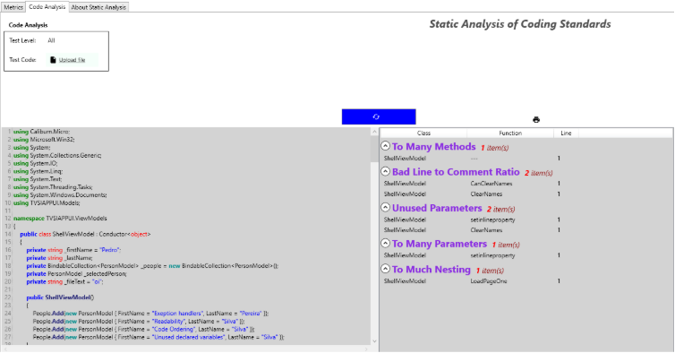
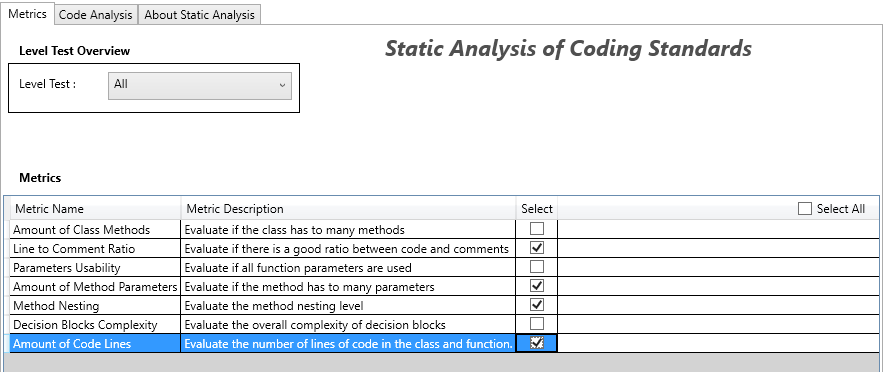
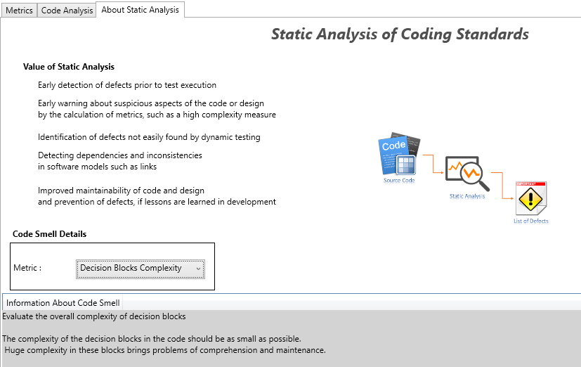

<h1> Análise estática de normas de codificação (AENC)</h1>

 A análise de código é um mecanismo de apoio à deteção de anomalias ou erros de concretização existentes num ambiente de programação. Diversos fatores podem levar ao aparecimento destes erros, destacando-se entre eles a programação inadequada, o conhecimento limitado das interfaces e outros factores inerentemente humanos como o esquecimento. As ferramentas de análise podem então ter um impacto positivo no ciclo de desenvolvimento de um produto, permitindo poupar tempo, dinheiro e contribuindo para que a aplicação seja construída sem vulnerabilidades de segurança. A análise de código pode ser efetuada em três modos: estática, dinâmica ou manual. Cada um destes modos têm as suas vantagens e desvantagens, sendo os mais usados os estáticos e os dinâmicos. 
Este projeto tem como principal foco a Análise Estática, em particular a Análise Estática de normas de codificação. Para o efeito, será desenvolvido um programa em linguagem C# que detecte code smells comuns num ficheiro, de modo a facilitar a sua posterior correção e garantir uma boa integridade do código desenvolvido.

 Após a seleção das métricas e ficheiro de código, o utilizador será informado sobre os possíveis bad smells detetados pela aplicação no código de acordo com as métricas anteriormente selecionadas.

<h1 align="center">
    
</h1>

 

 A cada nível estão associados alguns code smells que podem ser detetados posteriormente no código.

<h1 align="center">
    
</h1>

 

 Por meras questões informativas o utilizador pode ler um pouco sobre as características de cada code smell usado na aplicação sobretudo a razão pela qual é considerado um bad smell quando encontrado em algum código. Algumas das características mais vantajosas e importantes da análise estática são também descritas na aplicação com o intuito de dar a conhecer melhor ao utilizador a importância deste tipo de ferramenta para desenvolvedores de software.

<h1 align="center">
    
</h1>

 
<h4 align="center">
    Made with ❤ by pedromiguelcp. Project no longer under development. 🏁
</h4>